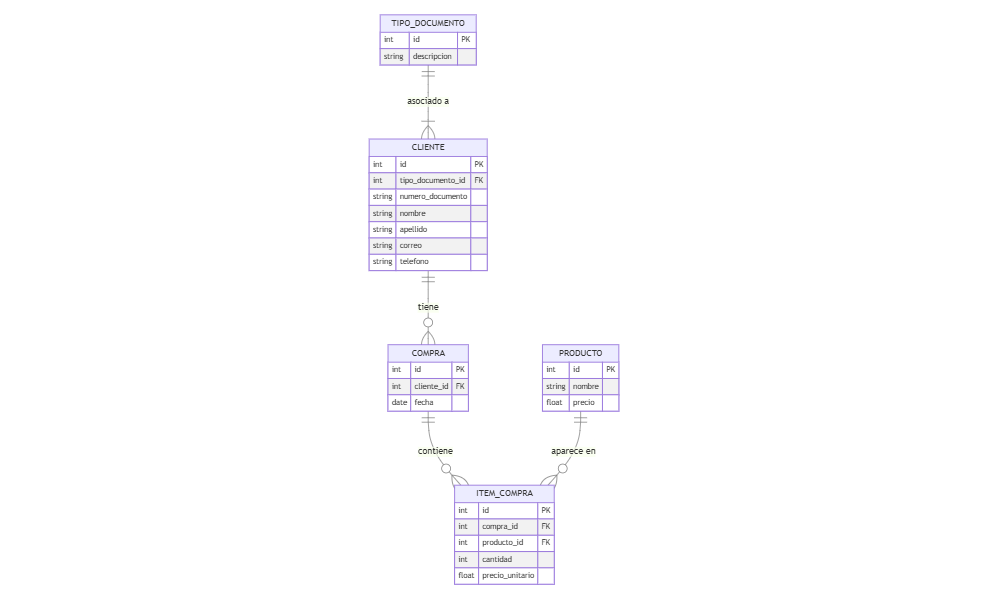

# Rios Del Desierto SaS - Prueba Técnica para Ingeniero de Desarrollo Falabella Colombia

## Descripción General del Proyecto

Rios Del Desierto SaS ha desarrollado una herramienta para el equipo de SAC (Servicio de Atención al Cliente) que permite:
- Consultar información de clientes por número de documento
- Automatizar la fidelización de clientes mediante informes de compras

### Tecnologías Clave
- **Backend:** Python con Flask
- **Frontend:** HTML, CSS (Bootstrap), JavaScript (Fetch API)
- **Base de Datos:** SQLite (escalable a otros SGBD)

## 1. Guía de Implementación

### Requisitos Previos
- **Python:** Versión 3.9.10 o superior
- **Git:** Instalado y configurado

### Pasos de Implementación

#### 1. Clonar el Repositorio
```bash
git clone https://github.com/julsanchezsa/Prueba_tecnica.git
```

#### 2. Crear y Activar Entorno Virtual
```bash
python -m venv venv
source venv/bin/activate      # Linux/Mac
# venv\Scripts\activate        # Windows
```

#### 3. Instalar Dependencias
```bash
pip install -r requirements.txt
```

#### 5. Inicializar Base de Datos
Este paso solo es opcional, solo si quiere restaurar la base de datos original que se creo. Pero igualmente se tiene una copia en el repositorio


```bash
# Crea la bd 
python create_db.py

# Pobla la bd
python populate_db.py
```

#### 6. Probar en Modo Desarrollo
```bash
python run.py
# Verificar en http://127.0.0.1:5000/
```

## 2. Arquitectura del Proyecto

### Backend
- **Framework:** Flask
- **ORM:** Flask-SQLAlchemy

#### Endpoints de la API

**Clientes:**
- `/api/clientes/buscar`: Buscar cliente por tipo y número de documento
- `/api/clientes/exportar`: Exportar información del cliente a CSV
- `/api/clientes/todos`: Listar todos los clientes

**Compras:**
- `/api/compras/todas`: Listar todas las compras
- `/api/compras/buscar`: Buscar compras de un cliente
- `/api/compras/detalle/<compra_id>`: Detalles de los artículos de una compra

**Productos:**
- `/api/productos/todos`: Listar todos los productos

**Reportes:**
- `/api/reportes/reporte_fidelizacion`:Reporte de fidelización: Clientes con compras superiores a 5'000.000 COP en el último mes
- `/api/reportes/reporte_compras`: Reporte de todos los usuarios con sus compras.

### Frontend
- **Tecnologías:** HTML, CSS (Bootstrap), JavaScript (Fetch API), se utilizaron jinja templates, pero se hicieron consultas a la api.
- **Integración:** Solicitudes AJAX a API RESTful
- **Vistas:** Compras,clientes, productos

### Modelado de la Base de Datos



